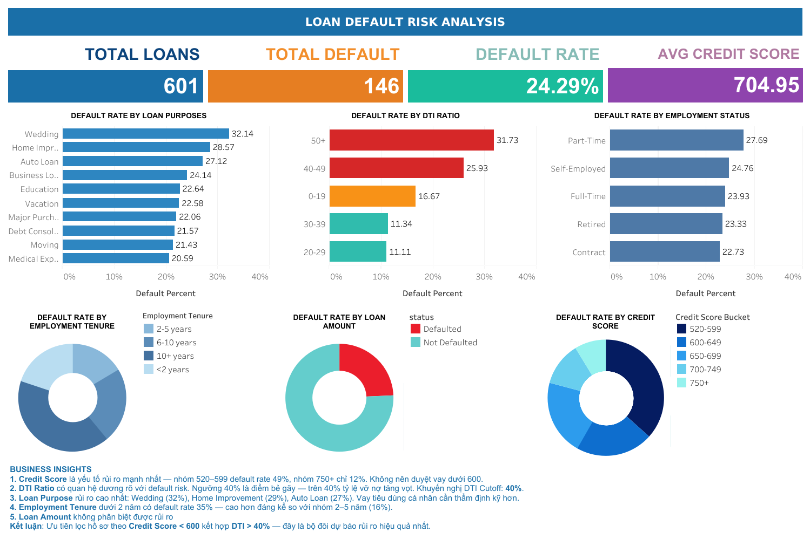

# loan-default-risk-analysis
EDA and risk analysis on loan default data using SQL and Tableau
# 🏦 Loan Default Risk Analysis

## 📌 Project Overview
Phân tích rủi ro vỡ nợ trên tập dữ liệu 601 khoản vay
sử dụng SQL để EDA và Tableau để visualization.

## 🎯 Business Questions
1. Yếu tố nào ảnh hưởng mạnh nhất đến khả năng vỡ nợ?
2. Ngưỡng DTI Ratio nào là điểm bẻ gãy rủi ro?
3. Credit Score bucket nào có tỷ lệ default cao nhất?
4. Loan Purpose nào rủi ro cao nhất?

## 🛠️ Tools Used
- **SQL** (MySQL/PostgreSQL) — Data querying & EDA
- **Tableau Public** — Interactive Dashboard
- **CSV** — Data source

## 📊 Dashboard Preview

🔗 [View Interactive Dashboard]
(https://public.tableau.com/views/LOANDEFAULTRISKANALYSIS_17784297362420/Dashboard2?:language=en-US&publish=yes&:sid=&:redirect=auth&:display_count=n&:origin=viz_share_link))

## 🔍 Analysis Process

### 1. Overall Default Rate
...

### 2. Default by Credit Score
...

(mỗi phần có SQL query + kết quả + insight)

## 💡 Key Insights
1. **Credit Score** là yếu tố rủi ro mạnh nhất...
2. **DTI Ratio** — ngưỡng 40% là điểm bẻ gãy...
3. **Loan Purpose** — Wedding loans rủi ro cao nhất...
4. **Employment Tenure** dưới 2 năm rủi ro cao hơn...
5. **Loan Amount** không phân biệt được rủi ro...

## ✅ Recommendations
- Không duyệt vay với Credit Score < 600
- Đặt DTI Cutoff tối đa 40%
- Thẩm định kỹ hơn với Wedding & Home Improvement loans
